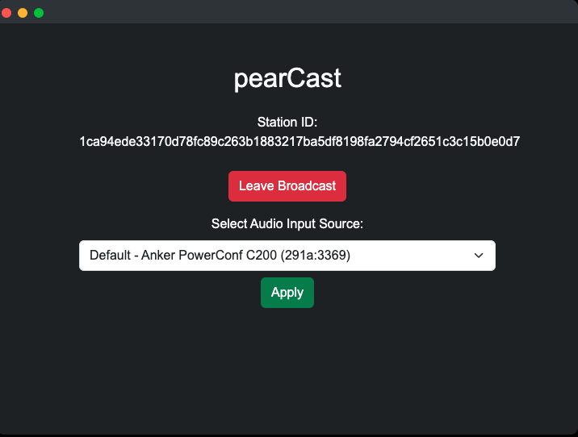
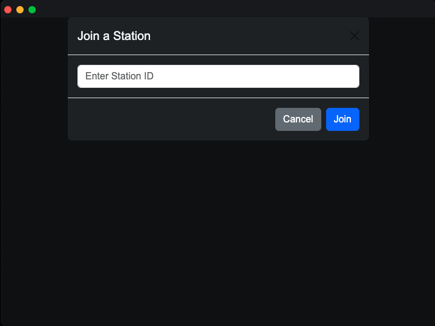
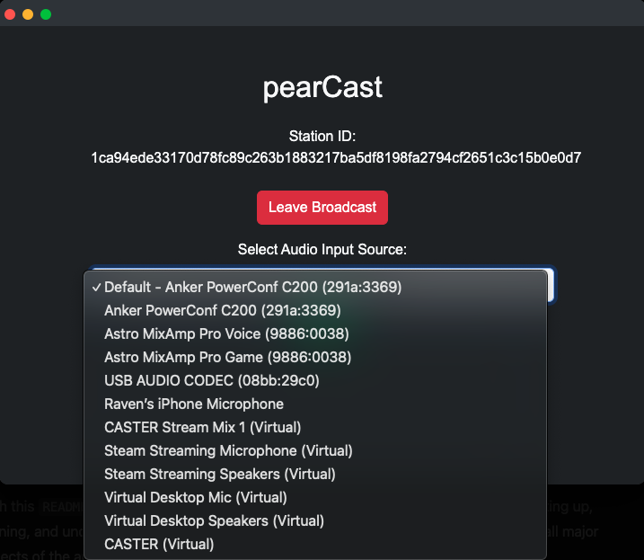

# pearCast - A Peer-to-Peer Audio Broadcasting App

`pearCast` is a decentralized, peer-to-peer (P2P) audio broadcasting application that enables users to broadcast and listen to live audio streams directly from a desktop app without relying on centralized servers or third-party STUN/TURN servers. Using Hyperswarm for P2P networking and WebRTC for audio streaming, `pearCast` allows users to create and join audio broadcast stations effortlessly.

Run the app on pear!

```bash
pear run pear://q3rutpfbtdsr7ikdpntpojcxy5u356qfczzgqomxqk3jdxn6ao8y
```

## Key Features

- **Create or Join a Station**: Host a broadcast or tune into an existing one.
- **Microphone Selection**: Broadcasters can select and switch between available audio input devices.
- **Real-time Audio Streaming**: Capture and stream live audio to all connected listeners using WebRTC.
- **Decentralized Networking**: Peer-to-peer connections using Hyperswarm, eliminating the need for centralized servers or third-party STUN/TURN servers.
- **Broadcaster-Hosted TURN Functionality**: The broadcaster hosts their own TURN-like functionality over Hyperswarm, enabling direct connections.
- **Error Handling**: Logs peer disconnections and connection resets without crashing.

## Technologies Used

- **[Hyperswarm](https://github.com/hyperswarm/hyperswarm)**: For discovering and connecting peers based on a shared "topic" key, ensuring direct connections without the need for central servers.
- **WebRTC**: For real-time audio streaming between peers, with custom signaling over Hyperswarm.
- **Web Audio API**: A powerful API for capturing and processing live audio in the browser.
- **Bootstrap**: For responsive and user-friendly UI elements.
- **JavaScript & Node.js**: Application logic, error handling, and P2P networking.
- **Pear CLI**: [Pear CLI](https://docs.pears.com/).

---

## Table of Contents

- [Getting Started](#getting-started)
- [User Guide](#user-guide)
  - [Creating a Broadcast Station](#creating-a-broadcast-station)
  - [Joining a Broadcast Station](#joining-a-broadcast-station)
  - [Changing Audio Input](#changing-audio-input)
- [Technical Details](#technical-details)
  - [How P2P Connections are Handled](#how-p2p-connections-are-handled)
  - [Custom Signaling over Hyperswarm](#custom-signaling-over-hyperswarm)
  - [Broadcaster-Hosted TURN-like Functionality](#broadcaster-hosted-turn-like-functionality)
  - [Audio Capture and Streaming](#audio-capture-and-streaming)
  - [Error Handling and Disconnection Logging](#error-handling-and-disconnection-logging)
- [Code Structure](#code-structure)
- [Example Screenshots](#example-screenshots)
- [Troubleshooting](#troubleshooting)

---

## Getting Started

### Prerequisites

- **Node.js**: Required to install dependencies and run the app.
- **Pear CLI**: Use the [Pear CLI](https://docs.pears.com/)

### Installation

1. **Clone the Repository**:
   ```bash
   git clone https://git.ssh.surf/snxraven/pearCast.git
   cd pearCast
   ```

2. **Install Dependencies**:
   ```bash
   npm install
   ```

3. **Run the App**:
   ```bash
   pear run --dev .
   ```

> **Note**: If you’re not using the Pear CLI, you can serve `index.html` through a local web server (e.g., using the `Live Server` extension in VSCode or a simple HTTP server).

---

## User Guide

### Creating a Broadcast Station

1. **Click "Create Station"**: Initiates a new station and begins capturing audio from the microphone.
2. **View Station ID**: Once created, the station will display a unique ID (based on a cryptographic key), which can be shared with others to join.
3. **Audio Input Selection**: Choose the desired microphone input from a dropdown menu, then click "Apply" to switch.
4. **Leaving the Broadcast**: Click "Leave Broadcast" to end the session, which will also disconnect all connected peers.

### Joining a Broadcast Station

1. **Click "Join Station"**: Opens a modal window.
2. **Enter Station ID**: Input the ID shared by the broadcaster and click "Join" to connect.
3. **Listen to Broadcast**: Audio from the broadcast will begin streaming in real-time using WebRTC.
4. **Leaving the Broadcast**: The listener can leave the broadcast by clicking "Leave Broadcast" or closing the connection in the browser.

### Changing Audio Input

**For Broadcasters Only**: Broadcasters can change their microphone input while streaming. Simply select a different device in the "Audio Input Source" dropdown and click "Apply" to switch. The broadcast will automatically start using the newly selected device.

---

## Technical Details

### How P2P Connections are Handled

The core networking functionality uses **Hyperswarm**. Each station (both broadcaster and listener) connects to a unique "topic" based on a cryptographic key. Hyperswarm manages discovery and connection setup without central servers by joining a Distributed Hash Table (DHT). Key components include:

1. **Generating a Station ID**: When a station is created, `crypto.randomBytes(32)` generates a 32-byte cryptographic key that uniquely identifies the broadcast. Hyperswarm joins this topic in "server mode" for the broadcaster and "client mode" for listeners.

2. **Peer Connections**: Both broadcaster and listener connections are managed by Hyperswarm's `swarm.on('connection')` event, which establishes a direct connection for signaling and data transfer.

3. **Custom Signaling**: The application uses custom signaling over Hyperswarm connections to exchange WebRTC session descriptions (SDP) and ICE candidates.

### Custom Signaling over Hyperswarm

- **Data Channels for Signaling**: Hyperswarm connections (`conn`) are used as data channels for exchanging signaling messages between the broadcaster and listeners.
- **Signaling Messages**: Offers, answers, and ICE candidates are serialized into JSON and sent over Hyperswarm connections.
- **PeerConnection Configuration**: WebRTC `RTCPeerConnection` is configured with an empty `iceServers` array, relying on the Hyperswarm network for connectivity.

### Broadcaster-Hosted TURN-like Functionality

- **Broadcaster as Relay**: The broadcaster effectively acts as a relay for media streams, mimicking TURN server behavior within the Hyperswarm network.
- **No Third-Party Servers**: This approach eliminates the need for external STUN/TURN servers, as the broadcaster handles the necessary signaling and relaying over Hyperswarm.
- **NAT Traversal**: Hyperswarm assists in establishing connections between peers even when they are behind NATs.

### Audio Capture and Streaming

Using **WebRTC** and the **Web Audio API**, `pearCast` captures and streams audio from the broadcaster to listeners.

1. **Audio Context Setup**: When a station is created, an `AudioContext` is initialized for audio processing.
2. **Local Media Stream**: The broadcaster captures audio using `navigator.mediaDevices.getUserMedia()` and adds the tracks to the `RTCPeerConnection`.
3. **Real-time Audio Streaming**: WebRTC handles the streaming of audio data between the broadcaster and listeners.
4. **Playback for Listeners**: Listeners receive the audio stream via the `ontrack` event and play it using an `<audio>` element.

### Error Handling and Disconnection Logging

- **Graceful Peer Disconnects**: Each connection includes error handling and disconnect logging. A connection reset (e.g., `ECONNRESET`) or manual disconnect is logged without crashing the app.
- **ICE Candidate Handling**: The application properly handles ICE candidates exchanged over Hyperswarm, ensuring a stable connection even in the absence of external servers.

---

## Code Structure

### HTML (`index.html`)

`index.html` contains the core layout and UI components:

- **Station Controls**: Create or join a station and leave the broadcast.
- **Audio Input Selection**: Available to broadcasters only, allowing them to change input sources.
- **Bootstrap Modals**: Provides a user-friendly modal interface for creating and joining stations.

### JavaScript (`app.js`)

`app.js` contains the main application logic:

- **Station Management**: Functions to create or join stations, handle connections, and manage disconnects.
- **Peer Connections**: Manages WebRTC `RTCPeerConnection` instances for each peer.
- **Custom Signaling**: Implements signaling over Hyperswarm connections for exchanging offers, answers, and ICE candidates.
- **Audio Capture & Streaming**: Configures audio context, captures microphone data, and handles streaming via WebRTC.
- **Error Handling**: Includes connection reset handling and graceful disconnect logging.
- **Audio Source Selection**: Enables broadcasters to choose from available audio input devices.

---

## Example Screenshots

| Feature                | Screenshot                                 |
|------------------------|--------------------------------------------|
| **Create Station**     | |
| **Join Station Modal** |     |
| **Audio Input Control**|     |

---

## Troubleshooting

1. **Connection Issues**:
   - Ensure both broadcaster and listener have network connectivity.
   - Check that the Station ID is correctly entered.

2. **No Audio Device Detected**:
   - Ensure your browser has permission to access the microphone, and refresh the device list if necessary.

3. **Audio Source Changes Not Applying**:
   - If changing the audio input source doesn't take effect, ensure you click "Apply" after selecting the device.

5. **NAT Traversal Issues**:
   - While Hyperswarm assists with NAT traversal, some restrictive network environments may still cause connectivity problems.